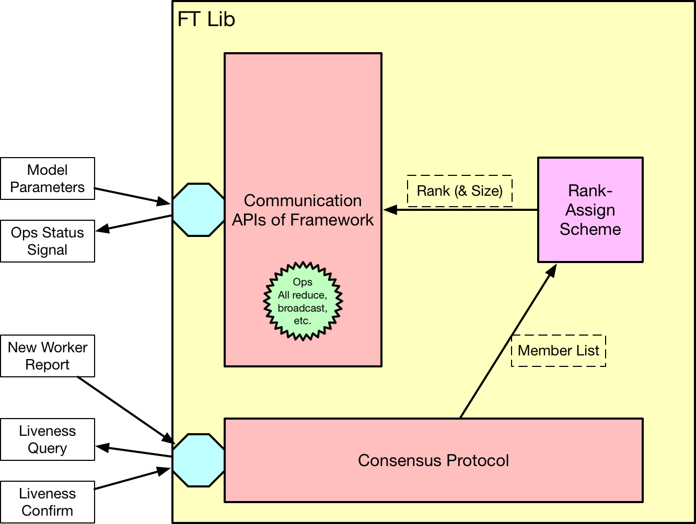
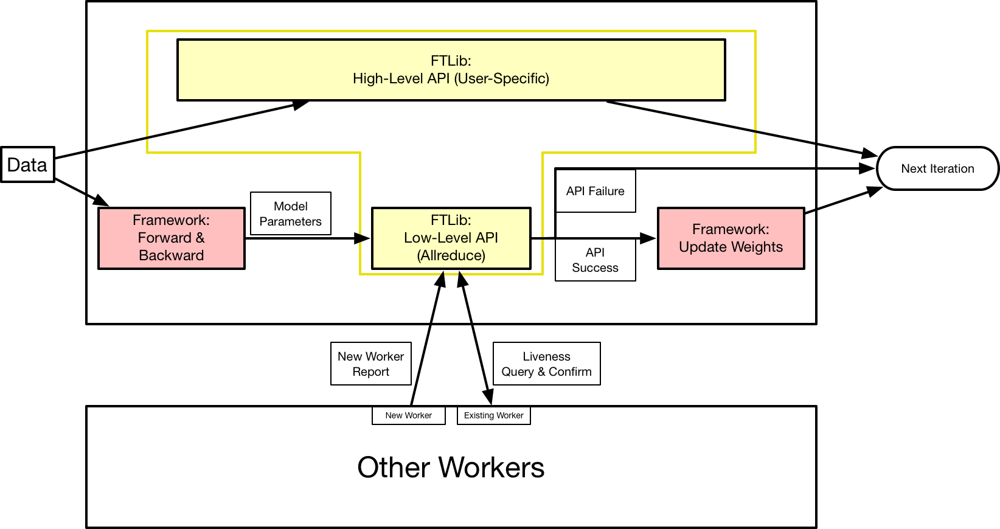
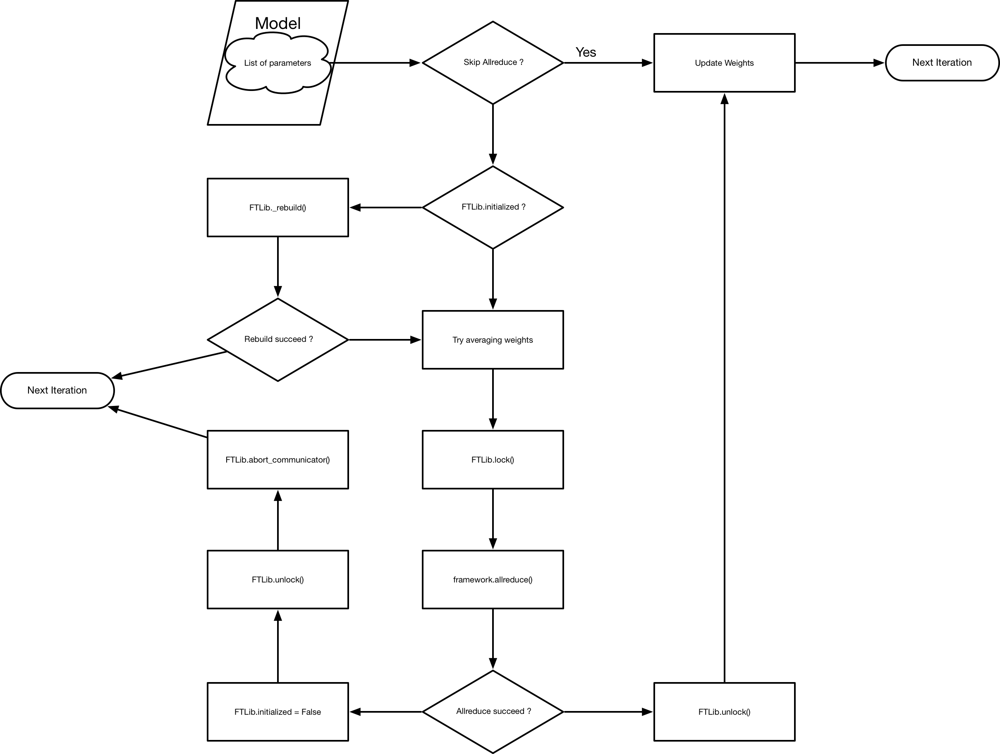

# FTLib Design

## Architecture

*Fig 1. General Architecture of FTLib*

FTLib maintains a set of low-level collective communication APIs as well as some high-level APIs for distributed training regardless worker loss of join. It consists of two major components:

1. Consensus Protocol: maintains the member list of all participating workers. This member list is consented by all participating workers.
2. Communication Library: provides communication APIs (*mostly for deep learning frameworks*).

Additionally, since most communication libraries require rank assigned to each worker, a rank-assign scheme is introduced to convert the member list into rank numbers on different workers.

## Role in Distributed Training

*Fig 2. The Role FTLib Played in Distributed Training*

In the contemporary design, the FTLib is called explicitly to perform low-level collective operations or a set of operations wrapped in `FTLib.execute()`.

For each batch of data, the model in each worker will be fed with training data, producing loss by forward calculation and gradients by backward propagation. Once local gradients are successfully calculated on each worker, the allreduce API in FTLib will be called to average the gradients across all workers. As the operation is blocking, it indicates all parameters on this process is ready to be updated if allreduce API returns success.

Otherwise, the training process will abort or continue according to different returned status.

The entire step described above can be wrapped into a high-level customized API with FTLib, which hides the latency of communication by overlapping computation and communication.

## Passive or Active Mode

With different consensus methods, FTLib wraps communication APIs with two modes:

- Active Mode: check member list consensus in `initialized()` and `skip_allreduce()` APIs  
- Passive Mode: not perform the check described in activate mode

Before launching any communication operations, the FTLib will lock all processes in all workers and unlock after finished or aborted. This design prevents the initialized flag from being modified by `Consensus.new_member_join`.

For details about passive and active mode in consensus, please refer the [consensus design doc](./consensus.md).

## FTLib Flow with Low-Level APIs

The flow chart below describes how FTLib works internally when low-level APIs are used in distributed training.

*Fig 3. The Internal Mechanism of FTLib*

The `is_initialized` flag of a FTLib will be reset (to `False`) under three occasions:

1. New workers report joining in
2. Collective-communication operations fail or time out
3. *Liveness probe fails for existing workers*

There are different approaches for liveness probe. *(For example, we force a `clean_ip` function for each worker at exit and scan the shared storage to check the existence of ip files as liveness probe. However, in the gossip-based consensus protocol, each worker will pull/push gossip messages of liveness from/to random nodes as liveness probe.)*
Here we assume the third case is or will eventually lead to the second one. Thusly, only the first and second occasions are handled explicitly in FTLib.

`FTLib._rebuild()` takes 3 steps sequentially:

1. use `Consensus.get_member_list` to get member list (*`get_member_list` will call `confirm` implicitly before returning member list*)
2. use `RankAssignScheme.get_rank_rand_size` to process member list and get rank and size
3. use `Framework.rebuild()` to perform necessary actions for re-initialize framework

Any exception in these 3 steps will make `FTLib._rebuild()` return rebuild failure.

## FTLib APIs (TODO: move to dev-guide)

FTLib provides the following APIs for initialization and communication:

### 1. FTLib.init(consensus, framework))

### 2. FTLib.initialized()

### 3. FTLib.allreduce_average(*args, **kwargs)

### 4. FTLib.wait_gradients_ready(*args, **kwargs)

### 5. FTLib.skip_allreduce()