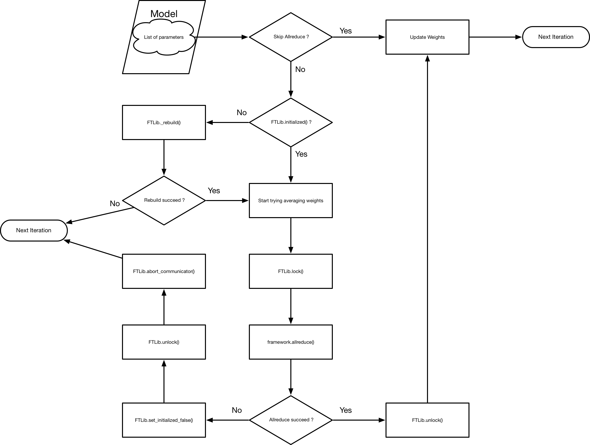

# FTLib Design

## Architecture

*Fig 1. General Architecture of FTLib*

FTLib maintains a set of collective communication APIs for distributed training regardless worker loss of join. It consists of two major components:

1. Consensus Protocol: maintains the member list of all participating workers. This member list is consented by all participating workers.
2. Communication APIs of Framework: provides communication APIs for deep learning frameworks.

Additionally, since most communication libraries require rank assigned to each worker, a rank-assign scheme is introduced to convert the member list into rank numbers on different workers.

## Role in Distributed Training

*Fig 2. The Role FTLib Played in Distributed Training*

In the contemporary design, the FTLib is called explicitly to perform collective operation on all parameters of a model.

For each batch of data, the model in each worker will be fed with training data, producing loss by forwarding and gradients by backward propagation. With local gradients ready on each worker, the allreduce API in FTLib will be called to average the gradients across all workers. As the operation is blocking, it indicates all parameters on this process is ready to be updated if allreduce API returns success. Otherwise, the training process will abort or continue according to different returned status.

Before launching any communication operations, the FTLib will lock the process and unlock after finished or aborted. This design prevents the initialized flag from being modified by `Consensus.new_member_join` on other thread during the average phase.

The initialized flag of a FTLib will be reset (to `False`) under three occasions:

1. New workers report joining in
2. Collective-communication operations fail or time out
3. *Liveness probe fails for existing workers*

Here we assume the third case is or will eventually lead to the second one. Thusly, only the first and second occasions are handled explicitly in FTLib.

*In the next design, we will consider hiding communication APIs of FTLib by wrapping model and optimizer, which hooks the communication operations for each parameter to its gradient calculation function. In this way, the optimizer will only need to check if all parameters hook are executed before updating weights.*

**The next design will have the communication and backward computation overlapped, reducing the overall training time.**

## FTLib Flow

The flow chart below describes how FTLib works internally.

*Fig 3. The Internal Mechanism of FTLib*

`FTLib._rebuild()` takes 3 steps sequentially:

1. use `Consensus.get_member_list` to get member list (*`get_member_list` will call `confirm` implicitly before returning member list*)
2. use `RankAssignScheme.get_rank_rand_size` to process member list and get rank and size
3. use `Framework.rebuild()` to perform necessary actions for re-initialize framework

Any exception in these 3 steps will make `FTLib._rebuild()` return rebuild failure.

## FTLib APIs

FTLib provides the following APIs for initialization and communication:

### 1. FTLib.init(consensus, framework))

### 2. FTLib.initialized()

### 3. FTLib.allreduce_average(*args, **kwargs)

### 4. FTLib.wait_weights_ready(*args, **kwargs)

### 5. FTLib.skip_allreduce()