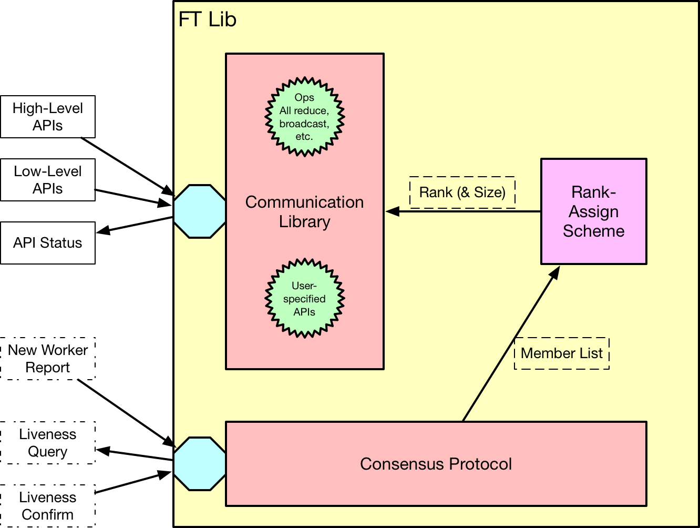

# FTLib Design

## Architecture

*Fig 1. General Architecture of FTLib*

FTLib maintains a set of workable collective operation APIs during distributed training regardless worker loss of join. It consists of two major components:

1. Consensus Protocol: maintains the member list of all participating workers. This member list is consented by all participating workers.
2. Communication APIs of Framework: provides communication APIs under specific deep learning framework.

Additionally, since most communication libraries require rank assigned to each worker, a rank-assign scheme is introduced to convert the member list into a rank number given different worker identity.

## Role in Distributed Training

In the contemporary design, the FTLib is called explicitly to perform allreduce operation on all parameters of a model.

During each data batch, model in every worker will be fed with a batch of data, get loss by forwarding and gradients by backward propagation. With local gradients ready on each worker, the allreduce API of FTLib will be called to average the gradients across all workers. With blocking communication operations, if allreduce returns success, it indicates all parameters on this process is ready to be updated. Otherwise, the training process will abort or continue according to different returned status.

Before launching any communication operations, the FTLib will lock the process and unlock after the communication is finished or aborted. This design is preventing initialized flag from being modified by `Consensus.new_member_join` from other thread.

The initialized flat of a FTLib will be reset (to `False`) under three occasions:

1. New workers report joining in
2. Collective-communication operations fail or time out
3. *Liveness probe fails for existing workers*

Here we assume the third case is or will eventually lead to the second case. Thusly, only the first and second occasions are handled explicitly in FTLib.

*In the next design, we will consider hiding communication APIs of FTLib by wrapping model and optimizer, which hooks the communication operation for each parameter to its gradient calculation function. In this way, the optimizer will only need to check if all parameters hook are executed before updating weights.*

**The next design will have the communication and backward computation overlapped, reducing the overall training time.**

*Fig 2. The Role FTLib Played in Distributed Training*

## FTLib APIs

FTLib provides the following APIs for initialization and communication:

### 1. FTLib.init(consensus, framework))

### 2. FTLib.initialized()

### 3. FTLib.allreduce_average(*args, **kwargs)

### 4. FTLib.wait_weights_ready(*args, **kwargs)

### 5. FTLib.skip_allreduce()

### 6. ? FTLib.broadcast()

### 7. ? FTLib.barrier()